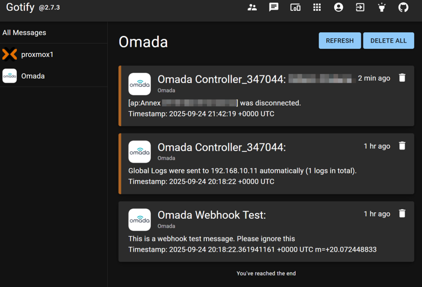

# omada-to-gotify

## Purpose

This is a small program written in Go which spawns a server that'll receive
webhook messages from a TP-Link Omada Network Controller, it converts them
into Gotify notifications and delivers them to Gotify.

Run it in Docker, in a LXC, or really anywhere you like (as long as the Omada
network can talk to it, and it can talk to your Gotify server).

## Installation / Configuration

This project uses environment variables for configuration. The following environment variables are in use:

### Required Variables

- `GOTIFY_URL` - The URL of your Gotify server (e.g., `https://gotify.example.com`)
- `GOTIFY_APP_TOKEN` - The token for your Gotify application (e.g., `abcdefg1234567890`) as configured inside Gotify

### Optional Variables

- `PORT` - The port on which to run the server (default is `8080`)

## Usage

To use this project:

1. Set the required environment variables
2. Launch the executable
3. Configure the webhook in Omada to match your environment variables: `http://${GOTIFY_URL}:${PORT}/omadaToGotify`
4. Wait for a message to come through from your Omada Controller and see it appear in Gotify!

If there are any errors in parsing or delivering, messages will be sent to the console.

## Future

- Better instructions, maybe a docker compose file or a basic LXC setup script.
- Right now this webhook doesn't authenticate the request. Quite simple to add, just not done yet.
- Specific support for more types of events from the Omada Controller, such as setting a priority based on message contents or doing more to augment the information given.
- Automated tests. Right now there aren't any tests.

## LICENSE

Copyright (c) 2025 Lianna Eeftinck <liannaee@gmail.com>

Permission is hereby granted, free of charge, to any person obtaining a copy of this software and associated documentation files (the "Software"), to deal in the Software without restriction, including without limitation the rights to use, copy, modify, merge, publish, distribute, sublicense, and/or sell copies of the Software, and to permit persons to whom the Software is furnished to do so, subject to the following conditions:

The above copyright notice and this permission notice shall be included in all copies or substantial portions of the Software.

THE SOFTWARE IS PROVIDED "AS IS", WITHOUT WARRANTY OF ANY KIND, EXPRESS OR IMPLIED, INCLUDING BUT NOT LIMITED TO THE WARRANTIES OF MERCHANTABILITY, FITNESS FOR A PARTICULAR PURPOSE AND NONINFRINGEMENT. IN NO EVENT SHALL THE AUTHORS OR COPYRIGHT HOLDERS BE LIABLE FOR ANY CLAIM, DAMAGES OR OTHER LIABILITY, WHETHER IN AN ACTION OF CONTRACT, TORT OR OTHERWISE, ARISING FROM, OUT OF OR IN CONNECTION WITH THE SOFTWARE OR THE USE OR OTHER DEALINGS IN THE SOFTWARE.